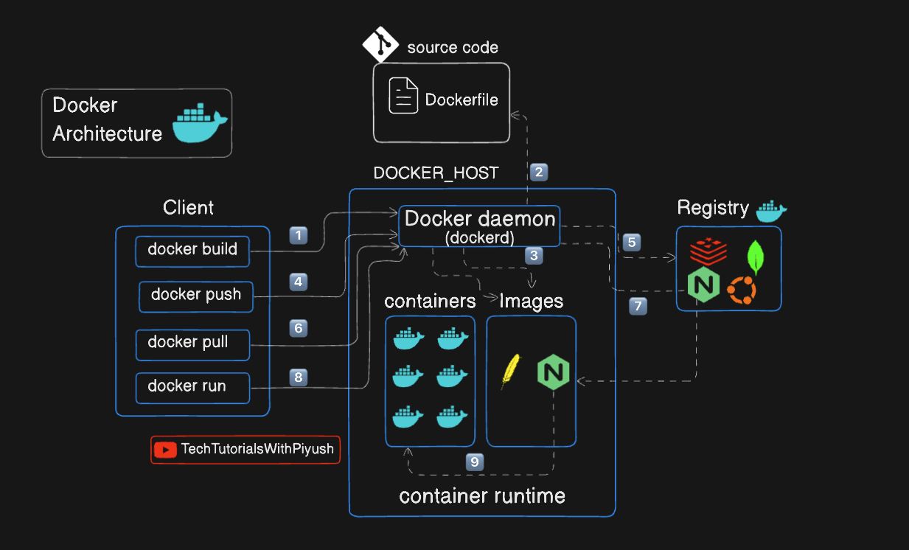

# Docker Fundamentals

This document provides an overview of Docker fundamentals, including key concepts, components, and architecture.

---

## Table of Contents

1. [What is Docker?](#what-is-docker)
2. [What is Containerization?](#what-is-containerization)
3. [What is Docker Image?](#what-is-docker-image)
4. [What is Dockerfile?](#what-is-dockerfile)
5. [What is Docker Hub?](#what-is-docker-hub)
6. [What is Docker Engine?](#what-is-docker-engine)
7. [Docker Containers vs Virtual Machines](#difference-between-docker-containers-and-virtual-machines)
8. [Working with Docker](#working-with-docker)
9. [Docker Architecture](#docker-architecture)
10. [How to Dockerize a Project](#how-to-dockerize-a-project)

---

## What is Docker?

Docker is an open-source platform that automates the deployment, scaling, and management of applications using containerization technology. Containers are lightweight, portable, and self-sufficient units that package an application along with its dependencies, libraries, and configuration files, allowing it to run consistently across different computing environments.

---

## What is Containerization?

Containerization is a method of virtualization that allows multiple isolated applications to run on a single host operating system. Unlike traditional virtual machines, which require a full operating system for each instance, containers share the host system's kernel while maintaining separate user spaces. This results in:

- Lower overhead
- Faster startup times
- Improved resource utilization

---

## What is Docker Image?

A Docker image is a lightweight, standalone, and executable software package that includes everything needed to run an application:

- Code
- Runtime
- Libraries
- Environment variables
- Configuration files

Docker images are built from a set of instructions defined in a Dockerfile and can be easily shared and distributed through container registries like Docker Hub.

---

## What is Dockerfile?

A Dockerfile is a text file that contains a series of instructions and commands used to build a Docker image. It specifies the base image, application code, dependencies, environment variables, and other configurations required to create a functional container. Dockerfiles enable developers to automate the image creation process and ensure consistency across different environments.

### Example of a Simple Dockerfile

```dockerfile
# Use an official Python runtime as a parent image
FROM python:3.8-slim

# Set the working directory in the container
WORKDIR /app

# Copy the current directory contents into the container at /app
COPY . /app

# Install any needed packages specified in requirements.txt
RUN pip install --no-cache-dir -r requirements.txt

# Make port 80 available to the world outside this container
EXPOSE 80

# Define environment variable
ENV NAME World

# Run app.py when the container launches
CMD ["python", "app.py"]
```

---

## What is Docker Hub?

Docker Hub is a cloud-based repository service provided by Docker that allows users to store, share, and manage Docker images. It serves as a central hub for finding and distributing containerized applications.

**Key Features:**
- Create public or private repositories
- Collaborate with others
- Access a vast library of pre-built images for various applications and services

---

## What is Docker Engine?

Docker Engine is the core component of the Docker platform that enables the creation, management, and running of containers. It consists of three main parts:

| Component | Description |
|-----------|-------------|
| **Docker Daemon** | The background service that manages Docker objects such as images, containers, networks, and volumes |
| **Docker CLI** | The command-line interface that allows users to interact with the Docker Daemon through commands |
| **REST API** | An application programming interface that enables programmatic access to Docker's functionalities |

---

## Difference Between Docker Containers and Virtual Machines

| Feature | Docker Containers | Virtual Machines |
|---------|-------------------|------------------|
| **Resource Usage** | Lightweight, shares host OS kernel | Heavyweight, requires full OS for each VM |
| **Startup Time** | Fast (seconds) | Slow (minutes) |
| **Isolation** | Process-level isolation | Full OS-level isolation |
| **Portability** | Highly portable across different environments | Less portable, dependent on hypervisor |
| **Performance** | Near-native performance | Overhead due to virtualization |

---

## Working with Docker

To work with Docker, you typically follow these steps:

1. Install Docker on your system
2. Create a Dockerfile to define your application's environment
3. Build a Docker image using the Dockerfile
4. Run a container from the Docker image
5. Manage and monitor your containers using Docker commands and tools
6. Push and pull images to/from Docker Hub or other container registries for sharing and collaboration

---

## Docker Architecture

Docker follows a client-server architecture consisting of the following components:

| Component | Description |
|-----------|-------------|
| **Docker Client** | The command-line interface (CLI) that users interact with to issue Docker commands |
| **Docker Daemon** | The background service that manages Docker objects and handles container operations |
| **Docker Images** | Read-only templates used to create containers |
| **Docker Containers** | Lightweight, portable, and self-sufficient units that run applications |
| **Docker Registries** | Repositories for storing and distributing Docker images, such as Docker Hub |
| **Docker Compose** | A tool for defining and managing multi-container Docker applications using a YAML file |
| **Docker Swarm** | A native clustering and orchestration tool for managing a group of Docker engines as a single virtual system |



---

## How to Dockerize a Project

To dockerize a project, follow these steps:

### 1. Install Docker

Ensure Docker is installed on your development machine.

### 2. Create a Dockerfile

In the root directory of your project, create a file named `Dockerfile` and define the necessary instructions to build your Docker image.

### 3. Build the Docker Image

Use the Docker CLI to build the image from the Dockerfile:

```bash
docker build -t your-image-name .
```

### 4. Run the Docker Container

Start a container from the built image:

```bash
docker run -d -p host-port:container-port your-image-name
```

### 5. Test the Application

Access your application through the specified host port to ensure it is running correctly inside the container.

### 6. Push to Docker Hub (Optional)

If you want to share your image, log in to Docker Hub and push your image:

```bash
docker login
docker tag your-image-name your-dockerhub-username/your-image-name
docker push your-dockerhub-username/your-image-name
```

### 7. Manage Containers

Use Docker commands to manage your containers:

| Command | Description |
|---------|-------------|
| `docker ps` | List running containers |
| `docker stop <container-id>` | Stop a running container |
| `docker rm <container-id>` | Remove a container |
| `docker images` | List all images |
| `docker rmi <image-id>` | Remove an image |


