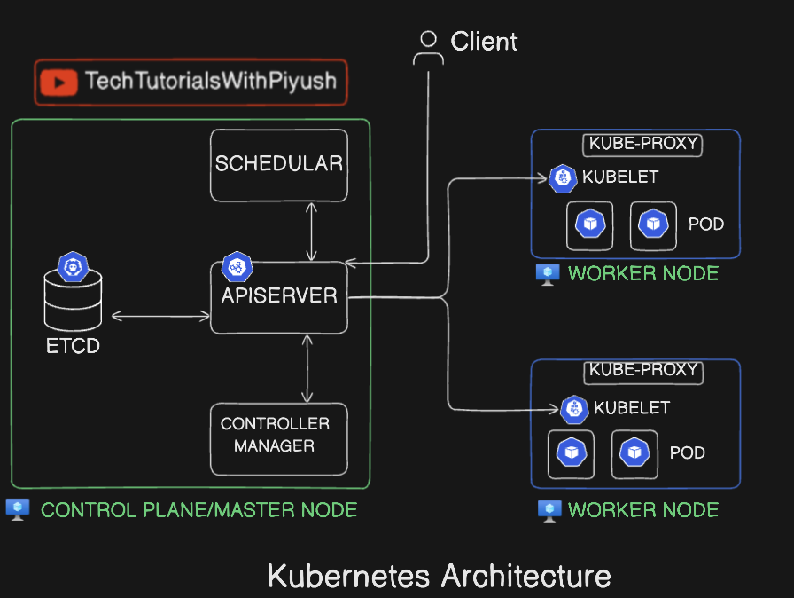

# What is Kubernetes?

Kubernetes (K8s) is an open-source container orchestration platform used to deploy, manage, scale, and operate containerized applications automatically.
It was originally developed by Google and is now maintained by the Cloud Native Computing Foundation (CNCF).

---

## 🔹 Why Kubernetes is Needed

When applications run in containers (Docker), managing:

* Hundreds of containers
* Scaling during traffic spikes
* Handling crashes
* Networking & load balancing

becomes very difficult manually.

👉 **Kubernetes solves all of this automatically.**

---

## 🔹 What Kubernetes Does (Core Functions)

| Feature                  | What it does               |
| ------------------------ | -------------------------- |
| Container Orchestration  | Manages container lifecycle |
| Auto Scaling             | Scales apps up/down        |
| Self-Healing             | Restarts failed containers |
| Load Balancing           | Distributes traffic        |
| Service Discovery        | Apps find each other       |
| Rolling Updates          | Zero-downtime deployments  |
| Configuration Management | Manages configs & secrets  |

---

# 🚢 Kubernetes Core Concepts Explained

---

## 1️⃣ Container Networking in Kubernetes

### 📌 What it is

Container networking defines **how Pods, services, and external users communicate** with each other inside and outside the Kubernetes cluster.

### 🔹 Key Rules (Kubernetes Networking Model)

* Every **Pod gets its own IP**
* Pods can communicate **without NAT**
* Containers inside a Pod share the **same network namespace**

### 🔹 Main Components

* **CNI (Container Network Interface)**
  Plugins like:

  * Calico
  * Flannel
  * Weave
  * Cilium

* **Kube-proxy**

  * Routes traffic to Pods
  * Implements Services using iptables/IPVS

### 🔹 Types of Communication

| Type               | Example                     |
| ------------------ | --------------------------- |
| Pod → Pod          | Backend talking to database |
| Pod → Service      | Frontend calling backend    |
| External → Service | User accessing app          |
| Node → Pod         | Health checks               |

### ✅ Example

```text
Frontend Pod → Backend Service → Backend Pod
```

---

## 2️⃣ Resource Management in Kubernetes

### 📌 What it is

Controls **CPU, memory, and storage usage** to prevent resource starvation and ensure fair allocation.

---

### 🔹 Requests & Limits

Defined per container.

```yaml
resources:
  requests:
    cpu: "250m"
    memory: "256Mi"
  limits:
    cpu: "500m"
    memory: "512Mi"
```

| Term    | Meaning            |
| ------- | ------------------ |
| Request | Guaranteed minimum |
| Limit   | Maximum allowed    |

---

### 🔹 QoS Classes

| Class      | Condition          |
| ---------- | ------------------ |
| Guaranteed | Requests = Limits  |
| Burstable  | Requests < Limits  |
| BestEffort | No requests/limits |

---

### 🔹 Autoscaling

* **HPA** – scales Pods
* **VPA** – adjusts resources
* **Cluster Autoscaler** – scales nodes

---

## 3️⃣ Security in Kubernetes

### 📌 What it is

Protects cluster, workloads, data, and network traffic.

---

### 🔹 Security Layers

#### 🔐 Authentication & Authorization

* RBAC (Role-Based Access Control)
* Service Accounts
* OAuth / Certificates

---

#### 🔐 Pod Security

* Pod Security Standards:

  * Privileged
  * Baseline
  * Restricted
* Security Context

```yaml
runAsNonRoot: true
```

---

#### 🔐 Network Security

* Network Policies (Pod-to-Pod control)

```text
Only frontend → backend allowed
```

---

#### 🔐 Secrets Management

* Kubernetes Secrets
* External vaults (HashiCorp Vault, AWS Secrets Manager)

---

#### 🔐 Image Security

* Scan images (Trivy)
* Use trusted registries
* Avoid `latest` tag

---

## 4️⃣ High Availability (HA) in Kubernetes

### 📌 What it is

Ensures the cluster **continues working even if components fail**.

---

### 🔹 Control Plane HA

* Multiple API Servers
* Multiple etcd nodes
* Load balancer in front

---

### 🔹 Application HA

* Multiple Pod replicas
* Multi-node deployment

```yaml
replicas: 3
```

---

### 🔹 Infrastructure HA

* Multi-AZ worker nodes
* Managed services (EKS, GKE)

---

### ✅ Result

* No single point of failure
* Zero downtime deployments

---

## 5️⃣ Fault Tolerance in Kubernetes

### 📌 What it is

Ability to **detect failures and recover automatically**.

---

### 🔹 How Kubernetes Handles Failures

| Failure           | Kubernetes Action |
| ----------------- | ----------------- |
| Pod crash         | Restart Pod       |
| Node down         | Reschedule Pods   |
| Container crash   | Restart container |
| Health check fail | Kill & recreate   |

---

### 🔹 Health Checks

* **Liveness Probe** – restart container
* **Readiness Probe** – remove from service
* **Startup Probe** – slow-start apps

---

### 🔹 ReplicaSets & Controllers

Ensure desired number of Pods are always running.

---

## 6️⃣ Service Discovery in Kubernetes

### 📌 What it is

Automatic way for Pods to **find and communicate with each other**.

---

### 🔹 Kubernetes Service

* Provides **stable IP & DNS name**
* Load balances traffic

```text
backend.default.svc.cluster.local
```

---

### 🔹 Types of Services

| Type         | Use                    |
| ------------ | ---------------------- |
| ClusterIP    | Internal communication |
| NodePort     | External (testing)     |
| LoadBalancer | Cloud external access  |
| Headless     | Direct Pod discovery   |

---

### 🔹 DNS-Based Discovery

* CoreDNS automatically assigns names
* No hardcoded IPs

---

## 🔄 Real-World Example (E-Commerce App)

```text
User → LoadBalancer → Frontend Service
Frontend Pod → Backend Service
Backend Pod → Database Pod
```

* Networking → Pod communication
* Resource Mgmt → CPU/memory limits
* Security → RBAC + Secrets
* HA → Multiple replicas
* Fault tolerance → Auto-restart
* Service discovery → DNS-based Services


# Kubernetes Architecture Diagram



Below is a **STEP-BY-STEP EXECUTION FLOW** of the **Kubernetes Architecture image** you shared, explained **clearly and in order**, exactly how Kubernetes works internally 👇

---

# 🚢 Kubernetes Architecture – Step-by-Step Execution

---

## 🔹 STEP 1: Client Sends Request

👤 **Client** (user, kubectl, CI/CD, UI)

```bash
kubectl apply -f deployment.yaml
```

* The client **never talks directly** to nodes
* Request goes **only to API Server**

➡️ **Client → API Server**

---

## 🔹 STEP 2: API Server Receives Request

🧠 **API Server** (Central Brain)

* Authenticates user (RBAC)
* Validates YAML (syntax & schema)
* Converts request into Kubernetes objects

➡️ If valid → stores state in **etcd**

---

## 🔹 STEP 3: State Stored in etcd

🗄️ **etcd** (Cluster Database)

* Stores desired state:

  * Pod specs
  * Deployment info
  * Replica count
* Acts as **single source of truth**

➡️ API Server ↔ etcd

---

## 🔹 STEP 4: Controller Manager Watches State

🔄 **Controller Manager**

* Continuously watches API Server
* Detects mismatch between:

  * Desired state (etcd)
  * Current state (cluster)

📌 Example:

```text
Desired Pods = 3
Running Pods = 0
```

➡️ Controller creates Pod objects

---

## 🔹 STEP 5: Scheduler Assigns Pod to Node

📅 **Scheduler**

* Notices Pods without assigned nodes
* Chooses best worker node based on:

  * CPU & Memory
  * Node health
  * Affinity rules

➡️ Scheduler updates API Server with node name

---

## 🔹 STEP 6: API Server Updates Node Assignment

* API Server stores scheduling decision in **etcd**
* Worker node becomes responsible for Pod

➡️ API Server → Kubelet (via watch)

---

## 🔹 STEP 7: Kubelet Creates Pod

🧩 **Kubelet (on Worker Node)**

* Watches API Server
* Receives Pod specification
* Talks to container runtime
* Pulls image & starts container

➡️ Pod is created and running

---

## 🔹 STEP 8: Kube-Proxy Configures Networking

🌐 **Kube-Proxy**

* Updates iptables/IPVS rules
* Enables Service → Pod communication
* Load balances traffic across Pods

➡️ Networking becomes active

---

## 🔹 STEP 9: Pod Runs Application

📦 **Pod**

* Contains application containers
* Shares:

  * Network
  * Storage
* Application starts serving requests

---

## 🔹 STEP 10: Client Accesses Application

👤 **Client**

```text
Client → Service → Kube-Proxy → Pod
```

* Traffic is routed & load balanced
* Application responds

---

## 🔹 STEP 11: Continuous Monitoring & Healing

🔄 Kubernetes constantly checks:

| Failure            | Action          |
| ------------------ | --------------- |
| Pod crashes        | Restart Pod     |
| Node fails         | Reschedule Pods |
| Health check fails | Replace Pod     |

---

# 🔄 Full Execution Flow (One Line)

```text
Client → API Server → etcd → Controller → Scheduler → Kubelet → Pod → Service → Client
```

---

# What is Master Node and Worker Node in Kubernetes?

In Kubernetes, the architecture is divided into two main types of nodes: **Master Node** (also known as Control Plane) and **Worker Node**. Each plays a crucial role in managing and running containerized applications.

---

## 🔹 Master Node (Control Plane)

The Master Node is the brain of the Kubernetes cluster. It is responsible for managing the cluster's overall state, making decisions, and orchestrating the worker nodes.

### Key Components of Master Node:

1. **API Server**: The entry point for all REST commands used to control the cluster. It processes requests from users, tools, and other components.
2. **etcd**: A distributed key-value store that holds the cluster's configuration data and state.
3. **Scheduler**: Assigns newly created Pods to worker nodes based on resource availability and other constraints.
4. **Controller Manager**: Runs various controllers that regulate the state of the cluster, ensuring that the desired state matches the actual state.

### Responsibilities:

* Managing the cluster state
* Scheduling Pods on worker nodes
* Monitoring and maintaining the desired state of applications

---

## 🔹 Worker Node

The Worker Node is where the actual applications run. It hosts the Pods, which are the smallest deployable units in Kubernetes.

### Key Components of Worker Node:

1. **Kubelet**: An agent that runs on each worker node, responsible for communicating with the Master Node and ensuring that the containers are running as expected.
2. **Kube-Proxy**: Manages network communication within the cluster, handling service discovery and load balancing.
3. **Container Runtime**: The software that runs the containers (e.g., Docker, containerd).

### Responsibilities:

* Running application workloads (Pods)
* Reporting node status to the Master Node
* Managing networking and communication between Pods

---

# What is kubectl in Kubernetes?

`kubectl` is the command-line tool used to interact with Kubernetes clusters. It allows users to deploy applications, inspect and manage cluster resources, and view logs.

---

