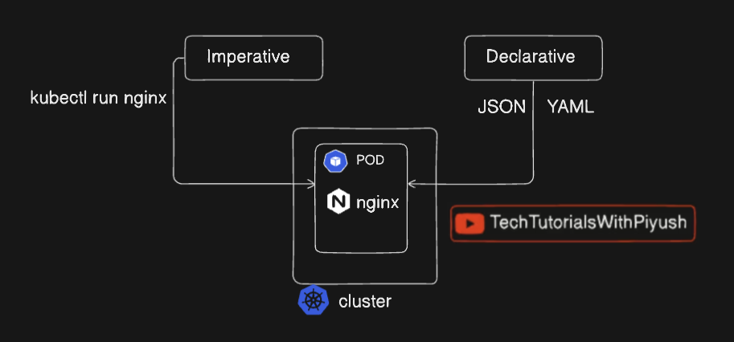

# 📦 What is a Pod in Kubernetes (K8s)?

## 🔹 Definition

A **Pod** is the **smallest and simplest deployable unit** in Kubernetes.
It represents **one or more tightly coupled containers** that:

* Share the same **network**
* Share the same **storage**
* Are scheduled and managed **together**

> 👉 Kubernetes does **not run containers directly** — it runs **Pods**.

---

## 🔹 Why Pods Exist (Not Just Containers?)

Containers alone cannot:

* Share IP address
* Share storage volumes easily
* Be managed as a single logical unit

Pods solve this by grouping containers that must work **closely together**.

---

## 🔹 Pod Architecture



This image explains **how a Pod (nginx) is created in a Kubernetes cluster using two different approaches: Imperative and Declarative**. I’ll explain it **step-by-step**, clearly linking each part of the diagram 👇

---

# 🚢 Kubernetes Pod Creation Architecture (Imperative vs Declarative)

---

## 🔹 Big Picture

The diagram shows:

* A **Kubernetes Cluster**
* A **Pod running nginx**
* **Two ways** to create/manage that Pod:

  1. **Imperative approach**
  2. **Declarative approach**

Both methods ultimately **create the same Pod inside the cluster**, but the **way you tell Kubernetes what to do is different**.

---

## 1️⃣ Imperative Approach (Left Side)

### 📌 What “Imperative” Means

👉 You tell Kubernetes **WHAT TO DO right now**.

> “Create this pod immediately.”

---

### 🔹 Command Used

```bash
kubectl run nginx --image=nginx
```

### 🔹 How it Works (Flow)

1. User runs `kubectl run nginx`
2. `kubectl` sends request to **API Server**
3. Kubernetes **immediately creates a Pod**
4. Pod runs **nginx container** inside the cluster

➡️ No file is stored
➡️ Quick and direct
➡️ Mostly used for **testing and learning**

---

### ❌ Limitations

* No version control
* Hard to reproduce
* Not recommended for production

---

## 2️⃣ Declarative Approach (Right Side)

### 📌 What “Declarative” Means

👉 You tell Kubernetes **WHAT YOU WANT**, not how to do it.

> “This is the desired state of my application.”

---

### 🔹 Files Used

* **YAML**
* **JSON**

Example (`pod.yaml`):

```yaml
apiVersion: v1
kind: Pod
metadata:
  name: nginx-pod
  labels:
    env: development
    type: webserver
spec:
  containers:
  - name: nginx
    image: nginx
```

Apply command:

```bash
kubectl apply -f pod.yaml
```

---

### 🔹 How it Works (Flow)

1. User writes YAML/JSON
2. Runs `kubectl apply`
3. File is sent to **API Server**
4. Kubernetes compares **desired state vs current state**
5. Pod is created or updated accordingly

➡️ State is **stored in etcd**
➡️ Reproducible
➡️ Production-ready

---

## 3️⃣ Common Endpoint: Kubernetes Cluster

Regardless of method:

* Both approaches create a **Pod**
* Pod runs **nginx container**
* Pod exists **inside the Kubernetes cluster**

```text
Imperative OR Declarative
          ↓
        API Server
          ↓
        Pod (nginx)
          ↓
        Cluster
```

---

## 🆚 Imperative vs Declarative (Quick Comparison)

| Feature         | Imperative    | Declarative |
| --------------- | ------------- | ----------- |
| Approach        | Command-based | File-based  |
| State stored    | No            | Yes         |
| Version control | ❌             | ✅           |
| Best for        | Testing       | Production  |
| Repeatability   | Low           | High        |

---

## 🎯 Interview One-Liner

> Kubernetes supports **imperative commands for quick actions** and **declarative configurations for managing desired state in production environments**.


# 📦 Kubernetes Pod Commands Cheat Sheet

---

## 🔹 1️⃣ Create Pod Commands

### Imperative Pod Creation

```bash
kubectl run nginx --image=nginx
```

With port:

```bash
kubectl run nginx --image=nginx --port=80
```

Dry run (generate YAML):

```bash
kubectl run nginx --image=nginx --dry-run=client -o yaml > pod.yaml
```

---

## 🔹 2️⃣ Create Pod (Declarative)

```bash
kubectl apply -f pod.yaml
```

---

## 🔹 3️⃣ List Pods

```bash
kubectl get pods
```

All namespaces:

```bash
kubectl get pods -A
```

With node info:

```bash
kubectl get pods -o wide
```

Watch pods:

```bash
kubectl get pods -w
```

---

## 🔹 4️⃣ Describe Pod (Very Important)

```bash
kubectl describe pod pod-name
```

Shows:

* Events
* Node details
* Errors
* Restart count

---

## 🔹 5️⃣ Pod Logs

Basic logs:

```bash
kubectl logs pod-name
```

Specific container:

```bash
kubectl logs pod-name -c container-name
```

Follow logs:

```bash
kubectl logs -f pod-name
```

Previous crashed container:

```bash
kubectl logs pod-name --previous
```

---

## 🔹 6️⃣ Execute Command Inside Pod

```bash
kubectl exec pod-name -- ls
```

Interactive shell:

```bash
kubectl exec -it pod-name -- /bin/bash
```

For multi-container pod:

```bash
kubectl exec -it pod-name -c container-name -- /bin/sh
```

---

## 🔹 7️⃣ Delete Pod

```bash
kubectl delete pod pod-name
```

Force delete:

```bash
kubectl delete pod pod-name --force --grace-period=0
```

Delete using file:

```bash
kubectl delete -f pod.yaml
```

---

## 🔹 8️⃣ Pod Status & Health

Check status:

```bash
kubectl get pod pod-name
```

Restart count:

```bash
kubectl get pod pod-name -o jsonpath='{.status.containerStatuses[*].restartCount}'
```

---

## 🔹 9️⃣ Debugging Pods

Events:

```bash
kubectl get events
```

Check failed pods:

```bash
kubectl get pods --field-selector=status.phase=Failed
```

---

## 🔹 🔟 Copy Files To/From Pod

To pod:

```bash
kubectl cp file.txt pod-name:/path/file.txt
```

From pod:

```bash
kubectl cp pod-name:/path/file.txt file.txt
```

---

## 🔹 1️⃣1️⃣ Pod Networking

Pod IP:

```bash
kubectl get pod pod-name -o wide
```

Port forward:

```bash
kubectl port-forward pod-name 8080:80
```

---

## 🔹 1️⃣2️⃣ Resource Usage

```bash
kubectl top pod
```

Specific pod:

```bash
kubectl top pod pod-name
```

📌 Requires metrics-server

---

## 🔹 1️⃣3️⃣ Label & Annotate Pods

Add label:

```bash
kubectl label pod pod-name env=prod
```

Remove label:

```bash
kubectl label pod pod-name env-
```

Add annotation:

```bash
kubectl annotate pod pod-name owner=devops
```

---

## 🔹 1️⃣4️⃣ Patch Pod

```bash
kubectl patch pod pod-name -p '{"metadata":{"labels":{"version":"v2"}}}'
```

---

## 🔹 1️⃣5️⃣ Pod YAML Output

```bash
kubectl get pod pod-name -o yaml
```

JSON:

```bash
kubectl get pod pod-name -o json
```

---

## 🔹 1️⃣6️⃣ Pod Scheduling Info

Node name:

```bash
kubectl get pod pod-name -o=jsonpath='{.spec.nodeName}'
```

---

## 🔹 1️⃣7️⃣ Pod Restart (Indirect)

```bash
kubectl delete pod pod-name
```

(Controller recreates it)

---

## 🔹 1️⃣8️⃣ Static Pod Check

```bash
ls /etc/kubernetes/manifests/
```

---

## 🔹 1️⃣9️⃣ Pod Security

Check security context:

```bash
kubectl get pod pod-name -o yaml | grep securityContext
```

---

## 🔹 2️⃣0️⃣ Namespace-Specific Pod Commands

```bash
kubectl get pods -n namespace-name
kubectl describe pod pod-name -n namespace-name
kubectl delete pod pod-name -n namespace-name
```

---

## 🎯 MOST IMPORTANT POD COMMANDS (Interview Focus)

```bash
kubectl get pods
kubectl describe pod
kubectl logs
kubectl exec
kubectl delete pod
```

---
