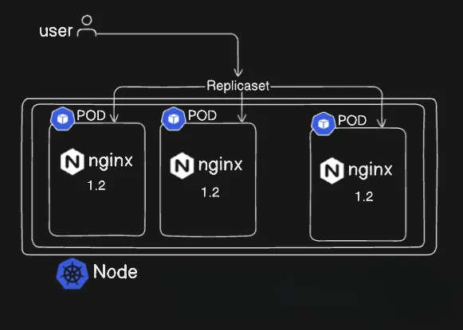
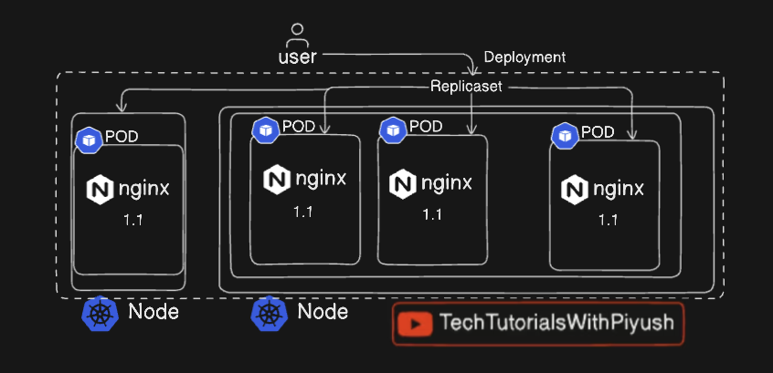

# 🚀 Kubernetes Deployment, ReplicationController & ReplicaSet Explained

## 📑 Table of Contents

1. [Quick Summary](#-quick-summary)
2. [Part 1: Replication Controller (RC)](#-part-1-replication-controller-rc)
3. [Part 2: ReplicaSet (RS)](#-part-2-replicaset-rs)
4. [Part 3: Deployment](#-part-3-deployment)
5. [Comparison Table](#-comparison-table)
6. [Interview Tips](#-interview-tips)

---

## 🎯 Quick Summary

| Component              | Description                                      | Status       |
| ---------------------- | ------------------------------------------------ | ------------ |
| Replication Controller | Ensures fixed number of Pods are always running  | ❌ Deprecated |
| ReplicaSet             | Modern replacement with set-based selectors      | ✅ Active     |
| Deployment             | Manages ReplicaSets with rolling updates         | ✅ Recommended|

> **Hierarchy:** `Deployment → ReplicaSet → Pods`

---

# 🔹 Part 1: Replication Controller (RC)



## 🧠 What is Replication Controller?

A **Replication Controller** ensures that a specified number of Pod replicas are running at any given time. If a Pod fails, the RC automatically creates a new one.

> ⚠️ **Note:** Replication Controller is **deprecated**. Use ReplicaSet or Deployment instead.

---

## 📋 How Replication Controller Works

### Step 1: User Defines Desired State

* User specifies:

  * Pod template
  * Number of replicas (e.g., 3)
  * Image: `nginx:1.2`

```text
User → Replication Controller
```

---

### Step 2: RC Creates Pods

* RC creates **3 identical Pods**
* Each Pod runs:

  * `nginx:1.2`

```text
RC
 ├── Pod (nginx 1.2)
 ├── Pod (nginx 1.2)
 └── Pod (nginx 1.2)
```

---

### Step 3: Self-Healing

* If **one Pod is deleted or crashes**:

```text
Desired = 3
Running = 2
→ RC creates 1 new Pod
```

---

## Example of Replication Controller YAML

```yaml
apiVersion: v1
kind: ReplicationController
metadata:
  name: nginx-rc
spec:
  replicas: 3
  selector:
    app: nginx
  template:
    metadata:
      labels:
        app: nginx
    spec:
      containers:
      - name: nginx
        image: nginx:1.2
```

---

# 🔹 Part 2: ReplicaSet (RS)

## 🧠 What is ReplicaSet?

A **ReplicaSet** is the modern replacement of Replication Controller. It ensures that a **specified number of Pods are always running** using **label selectors**.

> ✅ **ReplicaSet** supports **set-based selectors** (e.g., `In`, `NotIn`, `Exists`)

A **ReplicaSet** ensures that a **specified number of Pods are always running** using **label selectors**.

---

## � How ReplicaSet Works

### Step 1: User Creates ReplicaSet

User defines:

* Pod template
* Replicas (e.g., 3)
* Label selectors

```text
User → ReplicaSet
```

---

### Step 2: ReplicaSet Creates Initial Pods

* ReplicaSet creates **3 Pods**
* All Pods have same labels and image

```text
ReplicaSet
 ├── Pod (nginx 1.2)
 ├── Pod (nginx 1.2)
 └── Pod (nginx 1.2)
```

---

### Step 3: Pod Failure Occurs

* One Pod crashes or is deleted manually

```text
Before failure: 3 Pods
After failure: 2 Pods
```

---

### Step 4: ReplicaSet Detects Mismatch

ReplicaSet continuously checks:

```text
Desired replicas = 3
Current replicas = 2
```

---

### Step 5: ReplicaSet Creates New Pod (IMPORTANT)

* ReplicaSet **automatically creates a new Pod**
* New Pod has:

  * Same labels
  * Same image
  * Same configuration

```text
ReplicaSet
 ├── Pod (nginx 1.2)
 ├── Pod (nginx 1.2)
 └── NEW Pod (nginx 1.2) ✅
```

👉 This is **self-healing**

---

## Replication Controller vs ReplicaSet

| Feature            | Replication Controller | ReplicaSet |
| ------------------ | ---------------------- | ---------- |
| Pod creation       | Yes                    | Yes        |
| Self-healing       | Yes                    | Yes        |
| Selector type      | Equality-based         | Set-based  |
| Modern usage       | ❌ Deprecated           | ✅ Active   |
| Deployment support | ❌                      | ✅          |

---

## � ReplicaSet YAML Example

```yaml
apiVersion: apps/v1
kind: ReplicaSet
metadata:
  name: nginx-rs
spec:
  replicas: 3
  selector:
    matchLabels:
      app: nginx
  template:
    metadata:
      labels:
        app: nginx
    spec:
      containers:
      - name: nginx
        image: nginx:1.2
```

> 💡 **Note:** ReplicaSet is rarely created directly. It is automatically created and managed by Deployments.

---

# 🔹 Part 3: Deployment



## 🧠 What is a Deployment?

A **Deployment** is a higher-level abstraction that manages ReplicaSets and provides declarative updates to applications. It allows you to define the desired state of your application, and Kubernetes takes care of maintaining that state.

**Key Features:**
- ✅ Rolling updates (zero downtime)
- ✅ Rollback support
- ✅ Scaling
- ✅ Self-healing

> 💡 **Best Practice:** Always use Deployments in production instead of ReplicaSets directly.

---

## 📋 How Deployment Works

### Overview (Big Picture)

* **User** interacts with **Deployment**
* **Deployment** manages a **ReplicaSet**
* **ReplicaSet** manages multiple **Pods**
* Pods run **nginx (v1.1)** across multiple **Nodes**

```text
User → Deployment → ReplicaSet → Pods → Nodes
```

---

### Step 1: User Creates a Deployment

The user defines a **Deployment YAML** with:

* Number of replicas (e.g., 4)
* Container image (`nginx:1.1`)
* Update strategy (RollingUpdate)

```text
User → Deployment
```

---

### Step 2: Deployment Creates a ReplicaSet

* Deployment **does not create Pods directly**
* It creates a **ReplicaSet** based on the Pod template
* ReplicaSet is versioned internally

```text
Deployment
   ↓
ReplicaSet
```

---

### Step 3: ReplicaSet Creates Pods

* ReplicaSet creates the required number of Pods
* All Pods are identical:

  * Same image (`nginx:1.1`)
  * Same labels
* Pods may be scheduled on **different worker nodes**

```text
ReplicaSet
 ├── Pod (nginx 1.1)
 ├── Pod (nginx 1.1)
 ├── Pod (nginx 1.1)
 └── Pod (nginx 1.1)
```

---

### Step 4: Pods Run on Multiple Nodes

* Kubernetes Scheduler places Pods on available Nodes
* Improves:

  * High availability
  * Load distribution
  * Fault tolerance

```text
Node 1 → Pod
Node 2 → Pod
Node 3 → Pod
```

---

### Step 5: Self-Healing (Auto Recovery)

If a Pod crashes:

```text
Desired replicas = 4
Running replicas = 3
```

* ReplicaSet detects the mismatch
* Automatically **creates a new Pod**
* Deployment remains healthy

---

### Step 6: Rolling Updates (Key Feature)

If user updates image:

```text
nginx:1.1 → nginx:1.2
```

Deployment:

1. Creates a **new ReplicaSet**
2. Slowly creates new Pods (v1.2)
3. Gradually deletes old Pods (v1.1)
4. Ensures **zero downtime**

---

### Step 7: Rollback Support

If update fails:

```bash
kubectl rollout undo deployment nginx-deployment
```

* Deployment switches back to previous ReplicaSet

---

# 🆚 Comparison Table

## Deployment vs ReplicaSet

| Feature         | ReplicaSet | Deployment |
| --------------- | ---------- | ---------- |
| Pod management  | ✅          | ✅          |
| Rolling updates | ❌          | ✅          |
| Rollback        | ❌          | ✅          |
| Version history | ❌          | ✅          |
| Production use  | ⚠️         | ✅          |

---

## Example Deployment YAML

```yaml
apiVersion: apps/v1
kind: Deployment
metadata:
  name: nginx-deployment
  labels:
    app: nginx
spec:
  replicas: 4                     # Number of Pods
  selector:
    matchLabels:
      app: nginx
  strategy:
    type: RollingUpdate            # Zero-downtime updates
    rollingUpdate:
      maxSurge: 1
      maxUnavailable: 1
  template:
    metadata:
      labels:
        app: nginx
    spec:
      containers:
      - name: nginx
        image: nginx:1.1           # App version
        ports:
        - containerPort: 80
```

---

# 🎯 Interview Tips

## Quick One-Liners

| Component              | One-Liner                                                                 |
| ---------------------- | ------------------------------------------------------------------------- |
| Replication Controller | Ensures a fixed number of Pods are running but is **deprecated**          |
| ReplicaSet             | Ensures desired Pods are running; creates new Pods automatically on failure |
| Deployment             | Higher-level object that manages ReplicaSets with zero-downtime updates   |

## Key Points to Remember

1. **Replication Controller (RC)**
   - Ensures a fixed number of Pods are always running
   - If a Pod crashes, it creates a new one
   - ❌ **Deprecated** - used only for learning & legacy systems

2. **ReplicaSet (RS)**
   - Modern replacement for Replication Controller
   - Maintains desired number of Pod replicas
   - Usually managed by a Deployment
   - ⚠️ *Rarely used directly*

3. **Deployment (MOST IMPORTANT)**
   - Manages ReplicaSets and Pods
   - Provides: Rolling updates, Rollbacks, Scaling, Self-healing
   - ✅ **Best choice for production**

## Hierarchy to Remember

```text
Deployment → manages ReplicaSet → manages Pods
```

> 💡 **Interview Tip:** User interacts with Deployment, not Pods directly.

------
